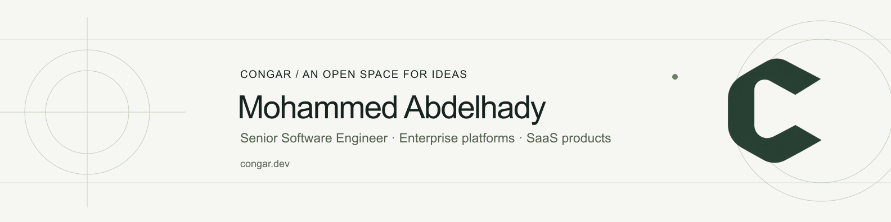

I'm Mohammed, a frontend-focused software engineer based in Abu Dhabi. I've spent more than a decade building enterprise platforms and SaaS products. I care about how an interface feels to use, and the fundamentals that make it reliable.

React and TypeScript are a large part of my work. So are performance, reusable UI systems, security, and the decisions that keep a growing application maintainable.

[My website](https://www.congar.dev/) · [Technical writing](https://www.congar.dev/articles) · [LinkedIn](https://www.linkedin.com/in/mohammedabdelhady/) · [DEV](https://dev.to/congar97)

### On the workbench

| Project | What I'm working on |
| --- | --- |
| [Hyperflow](https://github.com/Mohammed-Abdelhady/hyperflow) | Project-local workflows for planning, implementation, review, and handoff between coding tools. |
| [Phasewire](https://github.com/Mohammed-Abdelhady/Phasewire) | A local workflow workbench with a portable history of decisions and review. |
| [Authentication starter](https://github.com/Mohammed-Abdelhady/nextjs-nestjs-oauth-rbac-boilerplate) | Next.js and NestJS account flows, OAuth, roles, permissions, and sessions. |
| [Cloudix](https://www.congar.dev/projects/cloudix) | A personal cloud-storage application and its frontend architecture. |

### Notes from the browser

I write to understand what happens beneath an interface. Recent pieces work through:

- [React Fiber's tree and work loop](https://www.congar.dev/articles/react-fiber-tree-walk-loop)
- [Buffers, hooks, lanes, and commit](https://www.congar.dev/articles/react-fiber-buffers-hooks-lanes-commit)
- [JavaScript arrays and memory layout](https://www.congar.dev/articles/javascript-array-internals-memory-layout)
- [Event systems and file watchers](https://www.congar.dev/articles/javascript-event-systems-file-watcher)

[All writing on congar.dev](https://www.congar.dev/articles) · [More on DEV](https://dev.to/congar97)

### Work with teams

I'm currently a Senior Software Engineer at Traininpink. Earlier work includes government services with XD.AI and Dubai Municipality, and web and mobile products at Pharaoh Soft and Farah Egypt.

[Explore the projects and their stories](https://www.congar.dev/projects).
